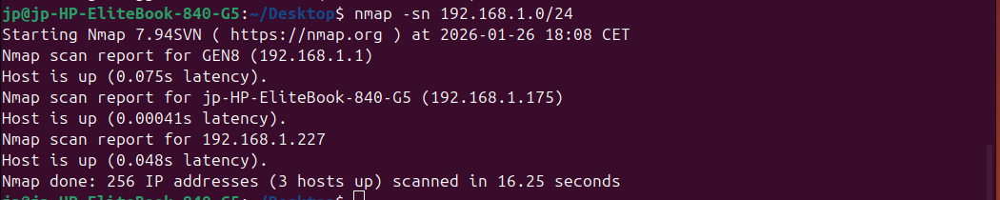
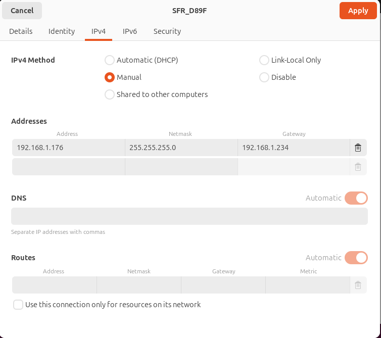

# B1 Linux - TP2

## I. Exploration locale en solo

### 1. Affichage d'informations sur la pile TCP/IP locale

### a) Infos des cartes réseau (WiFi + Ethernet) 
`ip addr show`

****

Résultats (extraits) :

    Interface WiFi

        Nom : wlp1s0

        MAC : 18:56:80:18:f3:26

        IP : 192.168.1.175/24

    Interface Ethernet

        Nom : enp0s31f6

        MAC : e4:e7:49:1d:45:73

        IP : aucune (interface DOWN)

### b)Adresse de réseau + broadcast

`ipcalc 192.168.1.175/24`

Résultats :

    WiFi (wlp1s0)

        Adresse de réseau : 192.168.1.0/24

        Adresse de broadcast : 192.168.1.255

    Ethernet (enp0s31f6)

        Non applicable car pas d’IP configurée (interface DOWN)

### c)Afficher la gateway (passerelle)

`ip route show default`

Gateway WiFi : 192.168.1.1 (default via 192.168.1.1 dev wlp1s0) [web:7]

### En graphique (GUI)

nfos relevées (interface WiFi) :

    IP : 192.168.1.175

    MAC : 18:56:80:18:f3:26

    Gateway : 192.168.1.1

# Question : À quoi sert la gateway dans le réseau d'Ingésup ?

La gateway (passerelle par défaut) est le routeur du réseau local (ex: 192.168.1.1) vers lequel le PC envoie tout trafic destiné à une adresse **hors** de son sous-réseau (par exemple, Internet).  
Elle sert donc de “sortie” du réseau local Ingésup vers d’autres réseaux et permet l’accès à Internet (souvent via du NAT).

#### A. Modification d'adresse IP - Pt. 1

**Calcul première/dernière IP disponible :**
- Réseau : `192.168.1.0/24` 
- **Première IP disponible : `192.168.1.1`** (adresse réseau .0 réservée)
- **Dernière IP disponible : `192.168.1.254`** (broadcast .255 réservé)
- IPs utilisables : **254 adresses** (1 à 254)

**Changement via interface graphique Ubuntu :**

**Vérification CLI après changement :**

#### B. nmap - Scanner réseau pour IP libre

**Scan réseau WiFi (Ping Scan) :**

Résultats du scan :

    Hôtes actifs détectés : [liste des IPs trouvées, ex: 192.168.1.1, .175, etc.]

    IP libre trouvée : 192.168.1.XXX (absent du scan, donc disponible)

Explication nmap :

    -sn = Ping Scan (détecte hôtes vivants sans port scan)

    192.168.1.0/24 = cible tout le réseau (256 adresses)

    Permet de voir quelles IPs sont occupées pour choisir une libre

#### C .Modification d'adresse IP - Pt. 2

Changement vers IP libre + gateway incorrecte :

Test connectivité Internet :

Explication du problème :

    IP libre OK → communication locale possible

    Gateway fausse → impossible d'atteindre Internet (pas de route vers 8.8.8.8)

    Même principe que DHCP automatique qui configure tout correctement

Retour configuration DHCP automatique :

