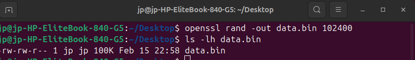
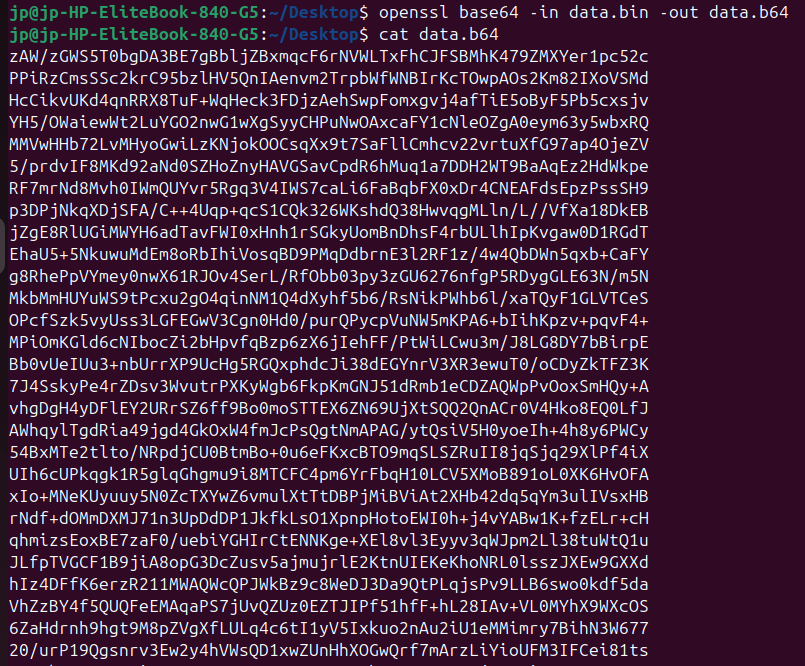
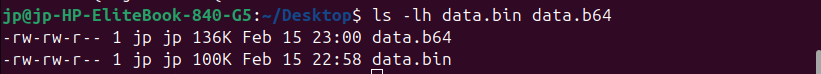
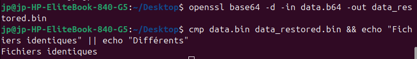
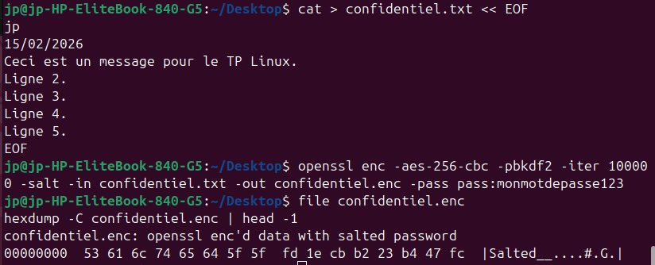
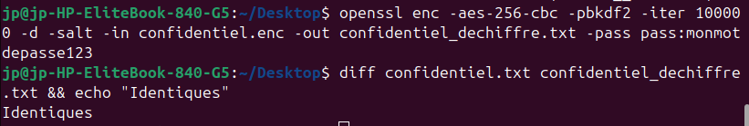
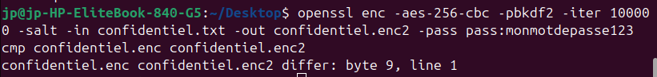
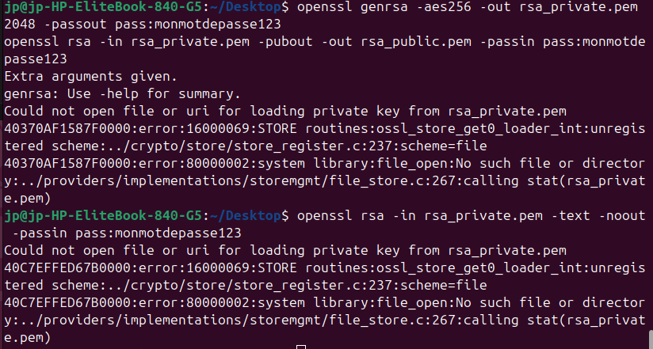
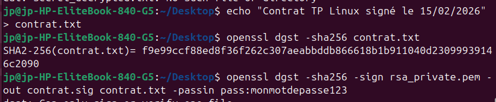
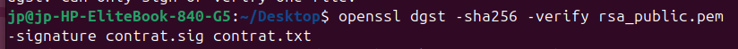

# A. Base64
## 1. Génération d’un fichier binaire

Commande utilisée :

openssl rand -out data.bin 102400

Vérification de la taille :

ls -lh data.bin

Résultat : 

## 2. Encodage

Commande utilisée :

openssl base64 -in data.bin -out data.b64

Affichage du contenu :

cat data.b64

Résultat : 

Comparaison des tailles :

ls -lh data.bin data.b64

Résultat :

## 3. Décodage

Commande utilisée :

openssl base64 -d -in data.b64 -out data_restored.bin

Vérification d’identité :

cmp data.bin data_restored.bin && echo "Fichiers identiques" || echo "Différents"

Résultat : Fichiers identiques 

## 4. Questions

**Base64 est-il un chiffrement ? Pourquoi ?**
    Non, Base64 est un encodage. Il transforme les données binaires en texte ASCII imprimable (6 bits → 1 char), mais ne cache pas les informations : quiconque connaît Base64 peut décoder facilement sans clé.

**Pourquoi la taille du fichier change-t-elle après encodage ?**
    Les 8 bits d’un octet deviennent 6 bits encodés (padding '=' ajouté), plus ~33% d’augmentation.​

**Quel est approximativement le pourcentage d’augmentation ?**
    ~33-37% (100K → ~136K).​

**Quelle méthode permet de vérifier rigoureusement que deux fichiers sont identiques ?**
    cmp fichier1 fichier2 ou diff -q ou md5sum fichier1 fichier2.​

# B. Chiffrement symétrique – AES
## 1. Création d’un message

Commande utilisée :

cat > confidentiel.txt << EOF
jp
15/02/2026
Ceci est un message pour le TP Linux.
Ligne 2.
Ligne 3.
Ligne 4.
Ligne 5.
EOF

## 2. Chiffrement

Commande utilisée : (AES-256-CBC avec sel, PBKDF2, SHA256)

openssl enc -aes-256-cbc -pbkdf2 -iter 100000 -salt -in confidentiel.txt -out confidentiel.enc -pass pass:monmotdepasse123

Vérification binaire :

file confidentiel.enc
hexdump -C confidentiel.enc | head -1

Résultat : data (binaire, pas texte) 

## 3. Déchiffrement

Commande utilisée :

openssl enc -aes-256-cbc -pbkdf2 -iter 100000 -d -salt -in confidentiel.enc -out confidentiel_dechiffre.txt -pass pass:monmotdepasse123

Vérification :

diff confidentiel.txt confidentiel_dechiffre.txt && echo "Identiques"

Résultat : Identiques 

## 4. Analyse

Deuxième chiffrement (même fichier/mot de passe) :

openssl enc -aes-256-cbc -pbkdf2 -iter 100000 -salt -in confidentiel.txt -out confidentiel.enc2 -pass pass:monmotdepasse123
cmp confidentiel.enc confidentiel.enc2

Résultat : différents (IV aléatoire) 

## 5. Questions

**Pourquoi les deux fichiers chiffrés sont-ils différents ?**
    Sel (salt) et IV (vecteur d’initialisation) aléatoires à chaque fois, même si clé identique.

**Quel est le rôle du sel ?**
    Rend la dérivation de clé unique par chiffrement, protège contre rainbow tables (attaques dictionnaire).​

**Que se passe-t-il si une option change lors du déchiffrement ?**
    Échec : mauvais padding, données corrompues ou erreur bad decrypt.​

**Pourquoi utilise-t-on PBKDF2 ?**
    Dérive lentement une clé forte d’un mot de passe faible via itérations/hachage (SHA256), résiste aux attaques force brute.

**Quelle est la différence entre encodage et chiffrement ?**
    Encodage (Base64) : réversible sans clé, pour transport. Chiffrement : nécessite clé secrète, protège confidentialité.​

# C. Cryptographie asymétrique – RSA
## 1. Génération de clés

Commande utilisée :

openssl genrsa -aes256 -out rsa_private.pem 2048 -passout pass:monmotdepasse123
openssl rsa -in rsa_private.pem -pubout -out rsa_public.pem -passin pass:monmotdepasse123

Paramètres clé privée :

openssl rsa -in rsa_private.pem -text -noout -passin pass:monmotdepasse123

Résultat : Modulus (2048 bits), publicExponent: 65537, privateExponent, primes p/q 

Paramètres clé publique :

openssl rsa -pubin -in rsa_public.pem -text -noout

Résultat : Modulus, publicExponent (pas privateExponent/primes) 

Comparaison : Même modulus/exposant public ; privée a extras privés.
## 2. Chiffrement asymétrique

Création secret.txt :

echo "Mon secret RSA" > secret.txt

Chiffrement/déchiffrement :

bash
openssl rsautl -encrypt -inkey rsa_public.pem -pubin -in secret.txt -out secret.enc
openssl rsautl -decrypt -inkey rsa_private.pem -in secret.enc -out secret_decrypted.txt -passin pass:monmotdepasse123
cat secret_decrypted.txt

Résultat : 

## 3. Questions

**Pourquoi la clé privée ne doit-elle jamais être partagée ?**
    Permet de déchiffrer tout message chiffré pour elle ou de signer frauduleusement.​

**Pourquoi RSA n’est-il pas adapté au chiffrement de gros fichiers ?**
    Limite taille (clé 2048 bits → ~245 bytes max), lent pour volumes ; hybride AES+RSA préféré.​

**Quelles différences observe-t-on entre les paramètres d’une clé publique et d’une clé privée ?**
    Publique : modulus + exposant public. Privée : + exposant privé, primes p/q, etc.​

**Quel est le rôle du modulo dans RSA ?**
    Produit p*q ; base de la sécurité (factorisation dure).​

**Pourquoi utilise-t-on souvent RSA pour chiffrer une clé AES plutôt qu’un document entier ?**
    RSA petit/lent → hybride : AES pour données (rapide), RSA pour clé AES (sécurisée).​

# D. Signature numérique
## 1. Création et signature

Fichier contrat.txt :

echo "Contrat TP Linux signé le 15/02/2026" > contrat.txt

Empreinte (hash) :

openssl dgst -sha256 contrat.txt

Signature :

openssl dgst -sha256 -sign rsa_private.pem -out contrat.sig contrat.txt -passin pass:monmotdepasse123

# 2. Vérification

Vérif initiale :

openssl dgst -sha256 -verify rsa_public.pem -signature contrat.sig contrat.txt

Résultat : Verified OK 

Modification :

echo "Modifié !" >> contrat.txt
openssl dgst -sha256 -verify rsa_public.pem -signature contrat.sig contrat.txt

Résultat : Verification Failure [Insérer screenshot ici]
# 3. Questions

**Que se passe-t-il après modification du fichier ?**
    Vérification échoue : hash changé, ne matche plus signature.​

**Pourquoi ?**
    Signature lie hash + clé privée ; altère fichier → nouveau hash → mismatch.​

**Quel est le rôle du hachage dans le mécanisme de signature ?**
    Réduit fichier à digest fixe (SHA256=32 bytes), signé au lieu du fichier entier ; détecte toute modif.​

**Quelle différence entre signature numérique et chiffrement ?**
    Signature : prouve authenticité/intégrité (non-répudiation). Chiffrement : confidentialité (cache contenu).​

# Bonus

Chiffrement hybride :

    Générer clé AES : openssl rand -out aes.key 32 (256 bits).

    Chiffrer gros fichier : openssl enc -aes-256-cbc -salt -in grosfichier.bin -out grosfichier.enc -K $(xxd -p -c 32 aes.key)

    Chiffrer clé AES : openssl rsautl -encrypt -pubin -inkey rsa_public.pem -in aes.key -out aes.key.enc

    Envoi : grosfichier.enc + aes.key.enc. Destinataire : déchiffre aes.key.enc → utilise clé AES pour grosfichier.
    Explication : AES rapide pour volume, RSA sécurise la clé AES (petite).

