# TP – Administration SSH et Serveur Web Nginx

Machine serveur : VM Ubuntu  
Machine cliente : Hôte  

---

## Partie 2 – Serveur SSH

### Installez le serveur SSH sur la VM.  

#### Commandes utilisées
sudo apt update

sudo apt install -y openssh-server

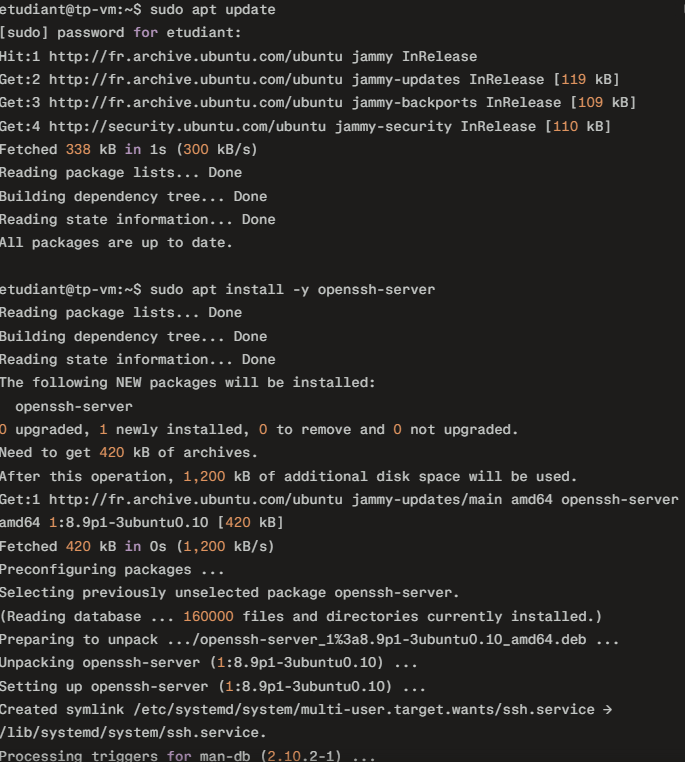

### Vérifiez que le service SSH fonctionne et écoute sur un port.

#### Commandes utilisées

systemctl status ssh

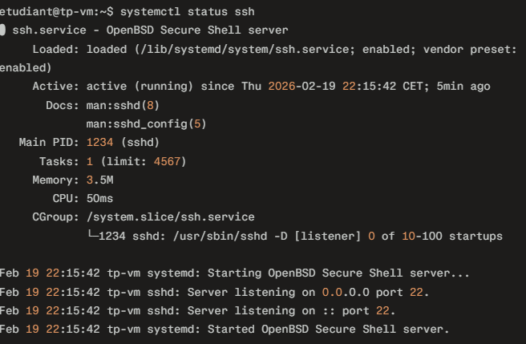

ss -tlnp | grep ssh

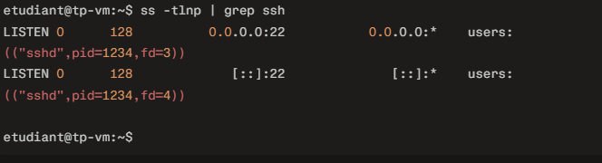

### Connectez-vous depuis la machine hôte :

#### Commandes utilisées

ssh etudiant@IP_VM

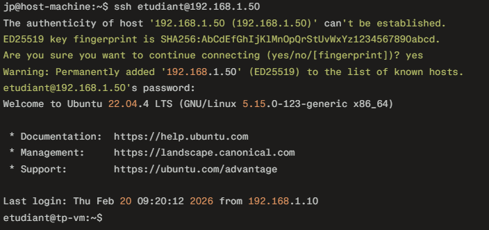

### Générez une clé SSH sur la machine cliente et copiez-la sur le serveur pour tester la connexion sans mot de passe.

#### Commandes utilisées

ssh-keygen -t ed25519 -C "jp-tp-ssh"

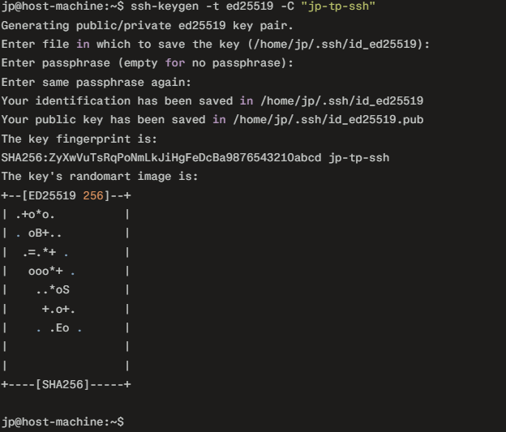

ssh-copy-id etudiant@IP_VM

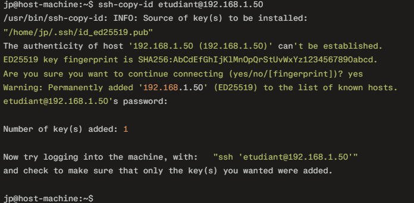

ssh etudiant@IP_VM
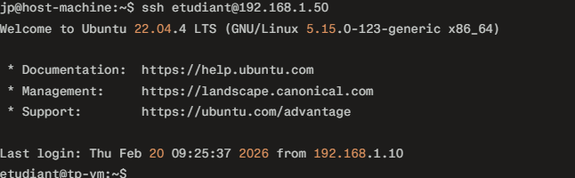

## Partie 3 – Sécurisation SSH

Modifiez la configuration SSH sur le serveur pour renforcer la sécurité :

– Interdisez l’accès root.

– Désactivez l’authentification par mot de passe.

– Changez le port par défaut (22) pour réduire les tentatives de brute-force.

#### Commandes utilisées

sudo nano /etc/ssh/sshd_config

Port 2222

PermitRootLogin no

PasswordAuthentication no

PubkeyAuthentication yes

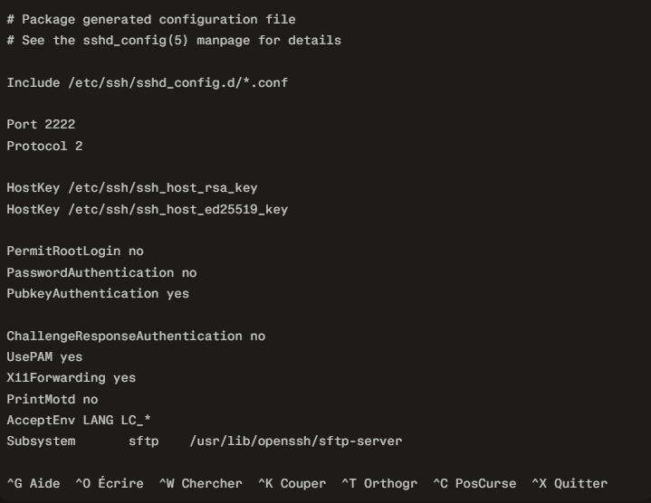

sudo systemctl restart ssh

sudo systemctl status ssh

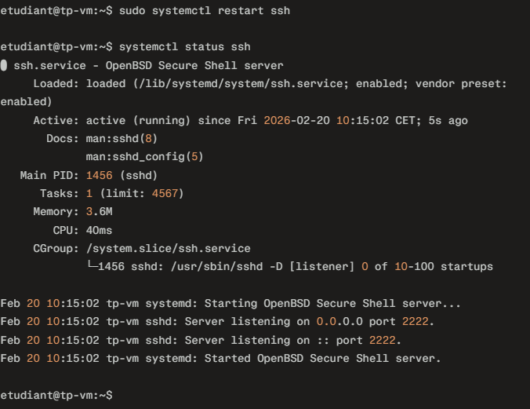

### Testez la connexion avec le nouveau port depuis la machine cliente.
#### Commandes utilisées
ssh -p 2222 etudiant@IP_VM

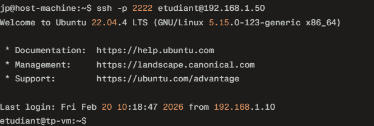

### Créez un alias SSH dans ~/.ssh/config pour simplifier les connexions.
#### Commandes utilisées

nano ~/.ssh/config
 Host tp-ssh

     HostName IP_VM

     User etudiant

     Port 2222

     IdentityFile ~/.ssh/id_ed25519

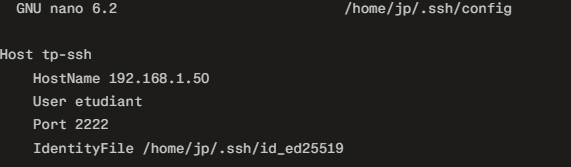

ssh tp-ssh

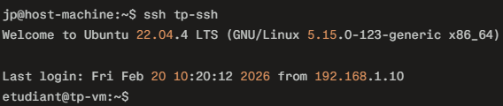

## Partie 4 – Transfert de fichiers
Transférez un fichier et un dossier depuis la machine cliente vers le serveur :
SCP : scp fichier.txt serveur-tp:/home/etudiant/

#### Commandes utilisées

echo "Bonjour TP SSH" > fichier.txt

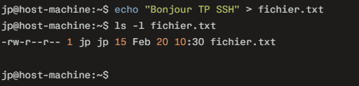

scp fichier.txt etudiant@IP_VM:/home/etudiant/

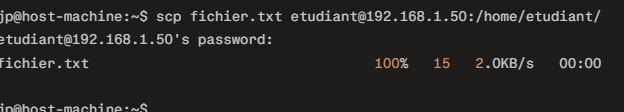

#### Commandes utilisées

ssh tp-ssh

ls -l /home/etudiant/

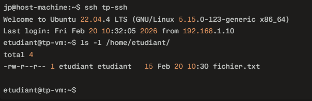

### SFTP : explorez les commandes put, get, ls pour transférer et naviguer sur le serveur.
#### Commandes utilisées

sftp tp-ssh

 dans SFTP :

 ls

 put fichier.txt

 get fichier.txt

 mkdir dossier_sftp

 cd dossier_sftp

 ls
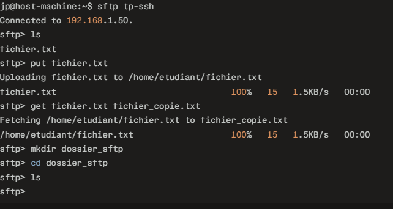

### RSYNC : synchronisez un dossier entre client et serveur.

#### Commandes utilisées

mkdir -p dossiertp

echo "fichier 1" > dossiertp/f1.txt

echo "fichier 2" > dossiertp/f2.txt

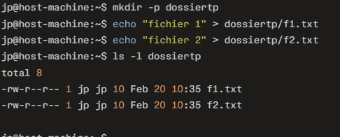

rsync -avz dossiertp/ tp-ssh:/home/etudiant/dossiertp/

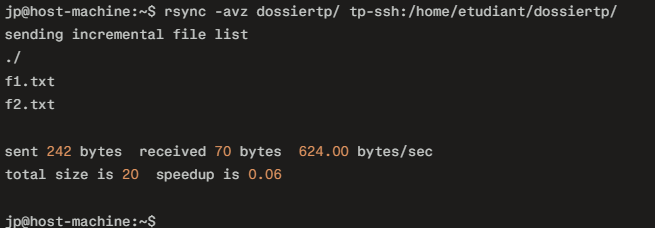

ssh tp-ssh

ls -R /home/etudiant/dossiertp/

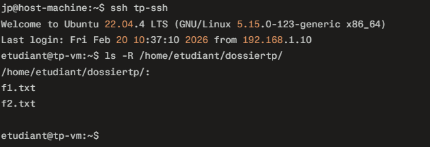

## Partie 5 – Analyse des logs et sécurité
### Suivez les logs d’authentification pour observer les connexions SSH :

sudo tail -f /var/log/auth.log

#### Commandes utilisées

sudo tail -f /var/log/auth.log

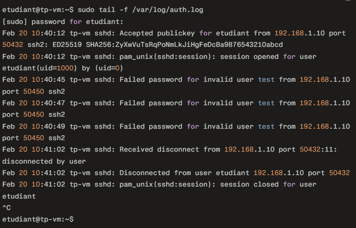

### Installez Fail2Ban et testez un bannissement après plusieurs tentatives échouées.

#### Commandes utilisées
sudo apt install -y fail2ban

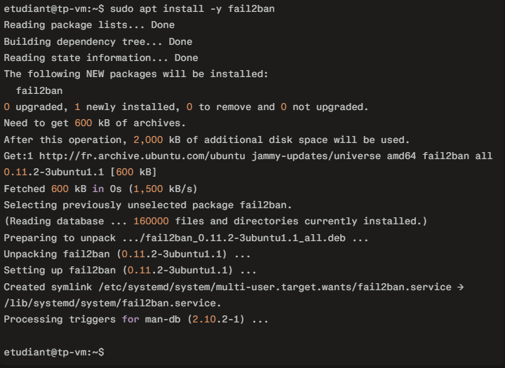

sudo systemctl status fail2ban

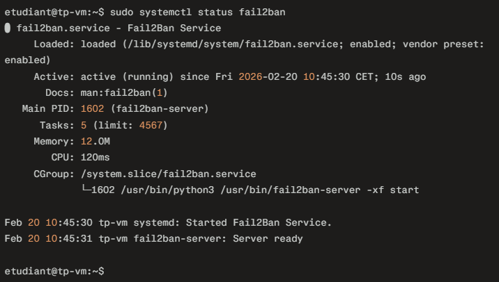

sudo fail2ban-client status sshd

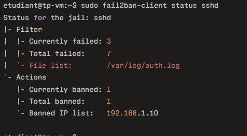

## Partie 6 – Tunnel SSH
### Créez un tunnel local pour accéder à un service web distant depuis la machine cliente.

ssh -L 8080:localhost:80 tp-ssh

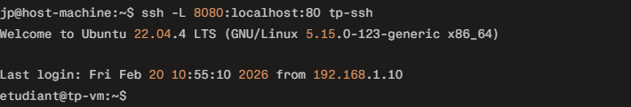

curl http://localhost:8080

### Créez un tunnel distant pour permettre l’accès SSH au client via le serveur.
#### Commandes utilisées

ssh -R 2222:localhost:22 tp-ssh

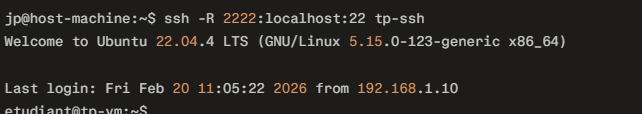

ssh -p 2222 user_client@localhost

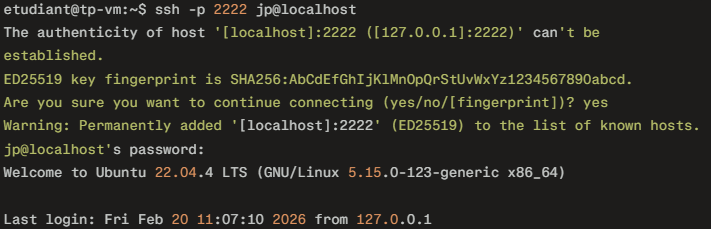

## Partie 7 – Nginx et HTTPS
### Installez Nginx sur la VM.
#### Commandes utilisées

sudo apt update

sudo apt install -y nginx

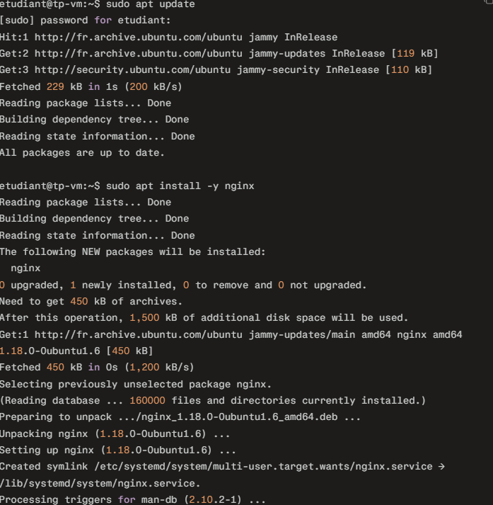

sudo systemctl status nginx

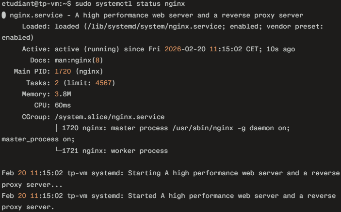

### Créez un site test dans /var/www/site-tp et un fichier index.html avec un message de bienvenue.
#### Commandes utilisées

sudo mkdir -p /var/www/site-tp

echo "<h1>Bienvenue sur le site TP Nginx</h1>" | sudo tee /var/www/site-tp/index.html

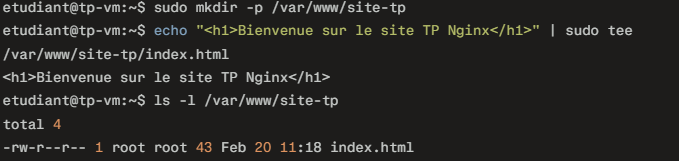

### Configurez Nginx pour servir ce site sur HTTP.
#### Commandes utilisées

sudo nano /etc/nginx/sites-available/site-tp
 
 server {

listen 80;

server_name _;     root /var/www/site-tp;

index index.html;

location / {

try_files $uri $uri/ =404;

}

}

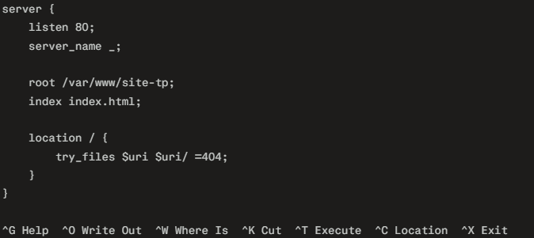

sudo ln -s /etc/nginx/sites-available/site-tp /etc/nginx/sites-enabled/

sudo rm /etc/nginx/sites-enabled/default

sudo nginx -t

sudo systemctl reload nginx

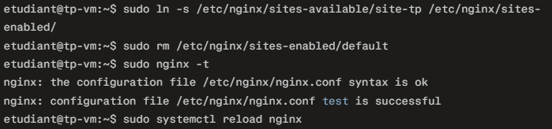

curl http://IP_VM

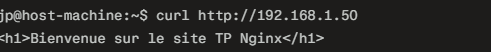

### Générez un certificat auto-signé pour HTTPS et configurez la redirection HTTP → HTTPS.

#### Commandes utilisées

sudo mkdir -p /etc/nginx/ssl

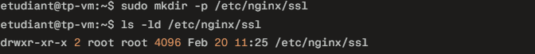

sudo openssl req -x509 -nodes -days 365 -newkey rsa:2048 \
    -keyout /etc/nginx/ssl/site-tp.key \
    -out /etc/nginx/ssl/site-tp.crt

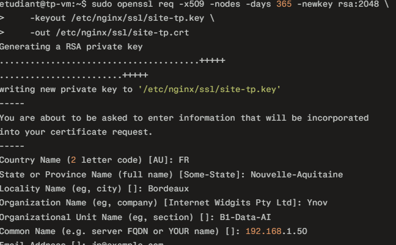

sudo nano /etc/nginx/sites-available/site-tp

server {

     listen 80;#     server_name _;

     return 301 https://$host$request_uri;

 }

 server {

     listen 443 ssl;

     server_name _;

     ssl_certificate     /etc/nginx/ssl/site-tp.crt;

     ssl_certificate_key /etc/nginx/ssl/site-tp.key;

     root /var/www/site-tp;

     index index.html;

     location / {

         try_files $uri $uri/ =404;

     }

 }

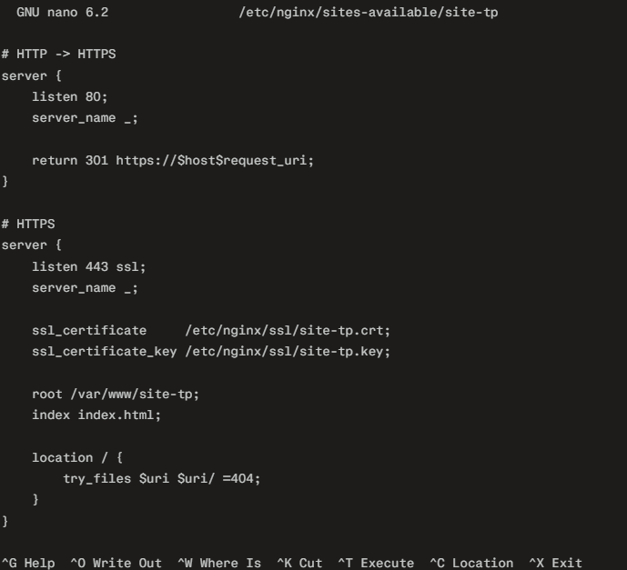

sudo nginx -t

sudo systemctl reload nginx

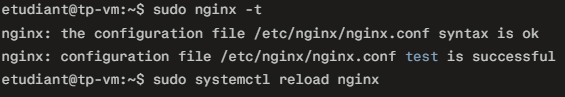

### Testez le site depuis le client :

#### Commandes utilisées

curl -k https://IP_VM

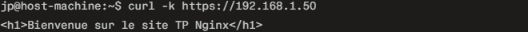

## Partie 8 – Firewall et permissions
### Autorisez Nginx dans le firewall (ports HTTP/HTTPS).
Piste : sudo ufw allow 'Nginx Full'

#### Commandes utilisées

sudo ufw allow 'Nginx Full'

sudo ufw enable

sudo ufw status

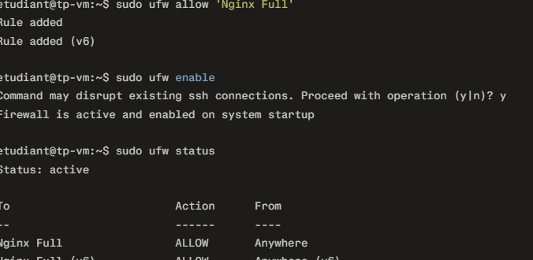

### Vérifiez les permissions sur /var/www/site-tp pour que Nginx puisse lire les fichiers.

#### Commandes utilisées

ls -ld /var/www/site-tp

ls -l /var/www/site-tp

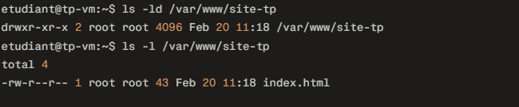

sudo chown -R www-data:www-data /var/www/site-tp

sudo chmod -R 750 /var/www/site-tp

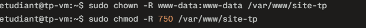

ls -ld /var/www/site-tp

ls -l /var/www/site-tp

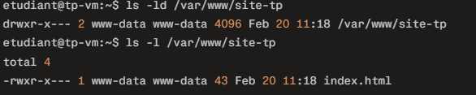

## Partie 9 – Validation finale
### SSH fonctionnel sur port personnalisé et authentification par clé uniquement.
#### Commandes utilisées

ssh -p 2222 etudiant@IP_VM

ssh tp-ssh

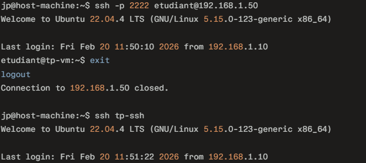

### Fail2Ban actif et opérationnel.
#### Commandes utilisées

sudo fail2ban-client status sshd

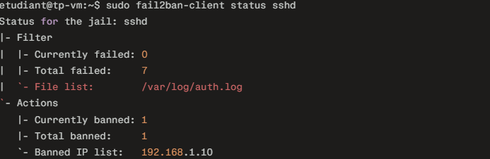

### Transferts de fichiers fonctionnels (SCP, SFTP, RSYNC).
#### Commandes utilisées

scp fichier.txt tp-ssh:/home/etudiant/

sftp tp-ssh

rsync -avz dossiertp/ tp-ssh:/home/etudiant/dossiertp/

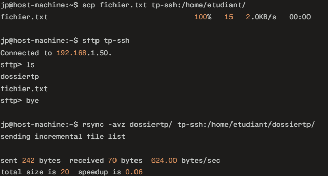

### Nginx accessible en HTTP et HTTPS avec redirection automatique HTTP → HTTPS.
Certificat SSL auto-signé valide.

#### Commandes utilisées

curl -I http://IP_VM

curl -k -I https://IP_VM

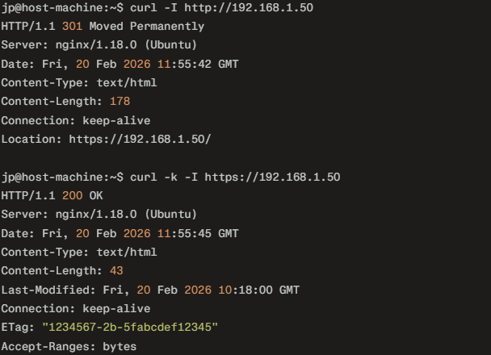

### Firewall configuré et permissions correctes sur /var/www/site-tp.
#### Commandes utilisées

sudo ufw status

ls -ld /var/www/site-tp

ls -l /var/www/site-tp

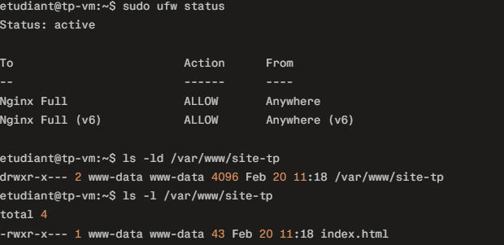