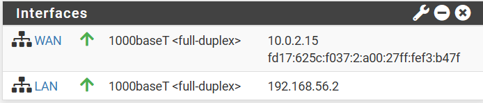
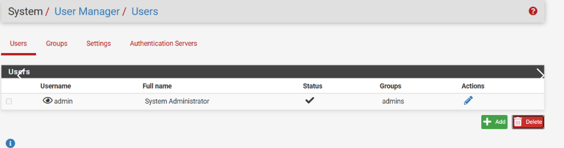
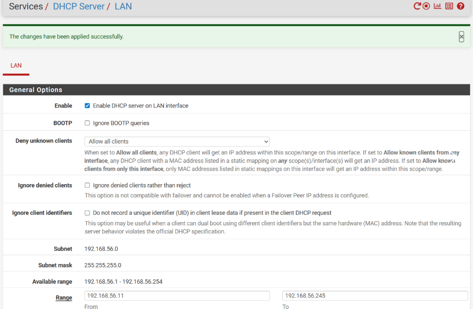

# TP5 : pfSense – Bases d'un pare-feu

## Partie 1 – Prise en main et sécurisation

### 1. Accès à l'interface

Connecté à l'interface web `https://192.168.1.1`.



**Questions :**

- **IP LAN ?** `192.168.1.1/24`
- **IP WAN ?** `10.0.2.15/24`
- **Pourquoi HTTPS ?** Chiffre les échanges admin, évite l'espionnage.
- **Pourquoi changer les identifiants par défaut ?** Mots de passe par défaut publics → risque de compromission immédiate.

### 2. Sécurisation de l'accès administrateur

Mot de passe changé dans **System > User Manager**.

**Questions :**

- **Où gérer les utilisateurs ?** `System > User Manager`
- **Mot de passe robuste ?** ≥12 caractères, mix casse, chiffres, symboles.
- **Pourquoi sécuriser l'accès admin en priorité ?** Permet de modifier toutes les règles, neutraliser la sécurité.



---

## Partie 2 – Comprendre les interfaces réseau

### 3. Vérification des interfaces

**Questions :**

- **Interface pour Internet ?** WAN
- **Interface pour réseau interne ?** LAN
- **Si inversées ?** LAN exposé à Internet sans protection, routage cassé.

---

## Partie 3 – Configuration des services réseau

### 4. DHCP

Activé sur LAN dans **Services > DHCP Server** (plage `192.168.1.100` – `200`).

**Questions :**

- **Pourquoi DHCP ?** Auto-configuration, évite conflits, gestion simplifiée.
- **Plage à choisir ?** Par exemple `.100` à `.200` ; laisser hors plage les adresses statiques (serveurs, passerelle).
- **Adresses à éviter ?** Celles déjà utilisées en statique

**Vérification :**

```bash
ip a   
```



### 5. DNS

Résolveur activé par défaut (Services > DNS Resolver).

**Questions :**

- **Pourquoi pfSense peut servir DNS ?** Cache/relais pour le LAN, filtrage possible.
- **DNS HS mais ping 8.8.8.8 OK ?** Connectivité OK mais résolution de noms défaillante → navigation impossible.

---

## Partie 4 – Autoriser l'accès Internet

### 6. Règles de pare-feu

Ajout règle LAN : Source LAN net, Destination any, Protocole any.

**Questions :**

- **Source ?** Réseau LAN (192.168.1.0/24)
- **Destination ?** any (pour accès Internet)
- **Tous protocoles ?** En production non ; ici pour test oui.

**Tests Ubuntu :**

```bash
ping 192.168.1.1      # OK
ping 8.8.8.8          # OK
nslookup google.com   # OK
curl http://example.com # OK
```


### 7. NAT

Vérifié dans Firewall > NAT > Outbound (mode automatique par défaut).

**Questions :**

- **Pourquoi NAT nécessaire ?** Traduit IP privées en IP publique (WAN) pour sortir sur Internet.
- **NAT auto vs manuel ?** Auto : pfSense génère les règles ; manuel : contrôle fin.
- **Vérifier traduction ?** `curl ifconfig.me` depuis Ubuntu → affiche IP du WAN pfSense.

---

## Partie 5 – Filtrage

### 8. Blocage d'un site spécifique

Bloqué facebook.com via alias IP (ou règle sur IP).

**Questions :**

- **Bloquer par IP ou nom ?** Par IP (pfSense ne filtre pas les noms directement). Mais IP peuvent changer → utiliser alias avec URL Table (IPs).
- **HTTPS ?** Blocage IP fonctionne toujours (connexion TCP coupée).
- **Contournement IP ?** Changement d'IP, VPN, proxy.

**Test :** Ping facebook.com → échoue. Logs firewall montrent block.

### 9. Blocage d'une catégorie de sites (jeux d'argent)

Création alias Jeux avec plusieurs sites, règle de blocage.

**Questions :**

- **Pourquoi pas une règle par site ?** Alourdit la config, maintenance difficile.
- **Où créer alias ?** Firewall > Aliases
- **Vérifier blocage ?** Logs firewall + test accès.

---

## Partie 6 – Aller plus loin

### 10. Blocage par catégorie (réseaux sociaux)

Alias Sociaux (twitter, instagram) + règle blocage.

**Question :**

- **Règle sous "Pass Any" ?** Blocage ignoré car le trafic est déjà autorisé. Ordre crucial.

### 11. Règles horaires

Schedule 9h-17h appliquée à la règle de blocage.

**Questions :**

- **Utilité en entreprise ?** Limiter distractions pendant heures de travail, les autoriser en dehors.

### 12. Serveur web local

Apache sur Ubuntu (`sudo apt install apache2`).

**Règles LAN :**

- Pass si source 192.168.1.50 et dest Ubuntu port 80.
- Block pour les autres sources, dest Ubuntu port 80.

**Questions :**

- **Filtrer par IP source ?** Oui.
- **Filtrer par port ?** Oui (seulement web).
- **Pourquoi protéger LAN en interne ?** Empêche propagation d'attaques internes.

### 13. Logs et analyse

Journalisation activée sur règles.

**Questions :**

- **Paquet bloqué vs autorisé ?** Log avec action "block" ou "pass".
- **Identifier règle ?** Numéro de règle dans log.
- **Sens du trafic ?** Source/destination indiquent la direction.

### 14. DMZ

Ajout interface DMZ (192.168.2.0/24) avec second Ubuntu.

**Questions :**

- **Qu'est-ce qu'une DMZ ?** Zone isolée pour serveurs accessibles depuis l'extérieur.
- **Pourquoi isoler ?** Si serveur compromis, pas d'accès direct au LAN.
- **DMZ accède au LAN ?** Non, par défaut bloqué.
- **LAN accède à DMZ ?** Oui, souvent autorisé pour admin.

### 15. Filtrage MAC

Règle avec source MAC.

**Question :**

- **Filtrage MAC sécurisé ?** Non, facile à usurper (spoofing). Sécurité faible.

### 16. Portail captif

Activé sur LAN (Services > Captive Portal).

**Questions :**

- **Contextes ?** Hotspots WiFi, réseaux invités.
- **Avantages vs simple règle ?** Authentification, limitation, personnalisation.

### 17. Sauvegarde / restauration

Sauvegarde XML via Diagnostics > Backup & Restore, modification, puis restauration.

**Question :**

- **Pourquoi sauvegarde régulière ?** Permet retour rapide après incident/erreur.

---
