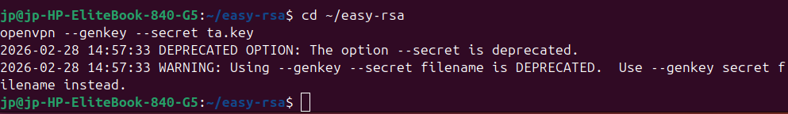
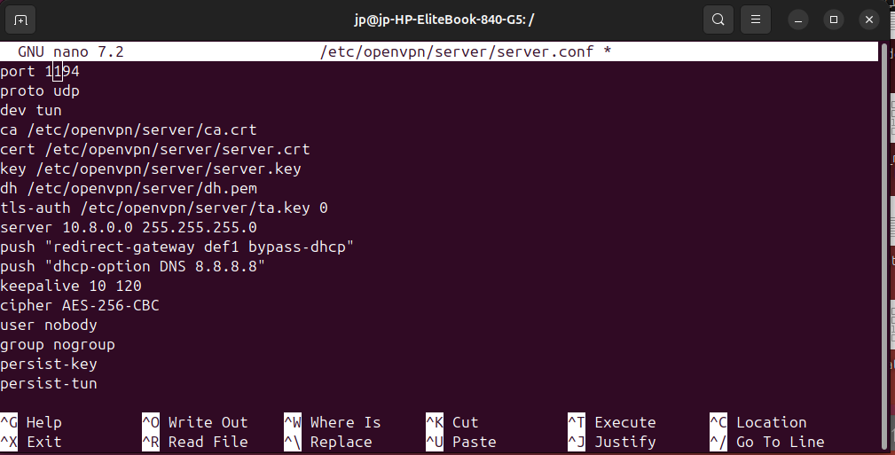
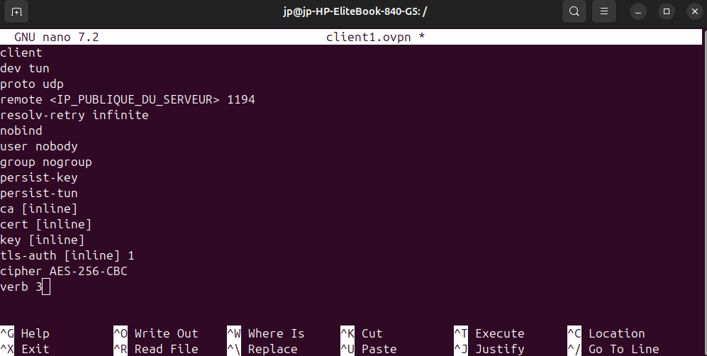
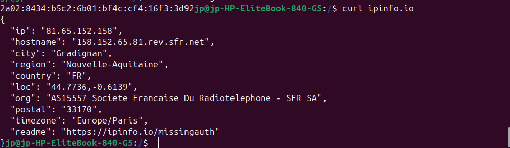

# TP6 – Mise en place d'un serveur OpenVPN sur Ubuntu Server

## Préparation du système

```bash
sudo apt update && sudo apt upgrade -y
sudo apt install openvpn easy-rsa -y
```

---


## Partie 1 : Comprendre la PKI

### Questions

**À quoi sert une autorité de certification (CA) ?**  
Elle signe les certificats (serveur/client) pour garantir leur authenticité.

**Différence entre clé privée et certificat ?**  
Clé privée = secret (chiffre/déchiffre) ; certificat = clé publique + infos, signé par la CA.

**Pourquoi un serveur VPN a-t-il besoin de certificats ?**  
Authentification mutuelle : le client vérifie le serveur (et inversement) pour éviter les usurpations.

### Création de l'infrastructure Easy-RSA

```bash
mkdir ~/easy-rsa
ln -s /usr/share/easy-rsa/* ~/easy-rsa/
cd ~/easy-rsa
./easyrsa init-pki
```

**Générer la CA (autorité) :**

```bash
./easyrsa build-ca
```

**Certificat serveur :**

```bash
./easyrsa gen-req server nopass
./easyrsa sign-req server server
```

**Certificat client :**

```bash
./easyrsa gen-req client1 nopass
./easyrsa sign-req client client1
```

**Paramètres Diffie-Hellman :**

```bash
./easyrsa gen-dh
```

**Clé TLS supplémentaire (authentification) :**

```bash
cd ~/easy-rsa
openvpn --genkey --secret ta.key
```


### Questions

**Où Easy-RSA crée-t-il ses fichiers ?**  
Dans `~/easy-rsa/pki/` (certificats, clés, requêtes).

**Que contient le dossier pki/ ?**  
`ca.crt`, certificats signés (`issued/`), clés privées (`private/`), requêtes (`reqs/`), `dh.pem`, `ta.key`.

**Différence entre gen-req et sign-req ?**  
`gen-req` : crée une requête (clé privée + CSR). `sign-req` : la CA signe le CSR pour produire le certificat.

**Si oubli de signer un certificat ?**  
Le certificat n'est pas valide ; la connexion échouera (erreur de vérification).

---

## Partie 2 : Configuration du serveur OpenVPN

### Fichier de configuration `/etc/openvpn/server/server.conf`

```ini
port 1194
proto udp
dev tun
ca /etc/openvpn/server/ca.crt
cert /etc/openvpn/server/server.crt
key /etc/openvpn/server/server.key
dh /etc/openvpn/server/dh.pem
tls-auth /etc/openvpn/server/ta.key 0
server 10.8.0.0 255.255.255.0
push "redirect-gateway def1 bypass-dhcp"
push "dhcp-option DNS 8.8.8.8"
keepalive 10 120
cipher AES-256-CBC
user nobody
group nogroup
persist-key
persist-tun
status /var/log/openvpn-status.log
log-append /var/log/openvpn.log
verb 3
```


**Copier les certificats générés :**

```bash
sudo cp ~/easy-rsa/pki/ca.crt /etc/openvpn/server/
sudo cp ~/easy-rsa/pki/issued/server.crt /etc/openvpn/server/
sudo cp ~/easy-rsa/pki/private/server.key /etc/openvpn/server/
sudo cp ~/easy-rsa/pki/dh.pem /etc/openvpn/server/
sudo cp ~/easy-rsa/ta.key /etc/openvpn/server/
```

### Questions

**Que signifie dev tun ?**  
Mode tunnel (IP) : crée une interface réseau virtuelle pour le VPN.

**Différence UDP/TCP pour un VPN ?**  
UDP : plus rapide, sans contrôle de flux (recommandé). TCP : plus fiable mais peut ralentir à cause des retransmissions.

**Plage IP pour le VPN ?**  
Réseau privé (ex: 10.8.0.0/24) – ne pas chevaucher les réseaux locaux existants.

### Routage et NAT

**Activer le forwarding IP :**

```bash
sudo sysctl -w net.ipv4.ip_forward=1
echo "net.ipv4.ip_forward=1" | sudo tee -a /etc/sysctl.conf
```


**Règle NAT (masquerade) pour que les clients VPN accèdent à Internet :**

```bash
sudo iptables -t nat -A POSTROUTING -s 10.8.0.0/24 -o eth0 -j MASQUERADE
```

### Questions

**Où configurer ip_forward ?**  
Dans `/etc/sysctl.conf` ou via `sysctl`.

**Commande pour afficher les règles NAT ?**  
`sudo iptables -t nat -L -v`

**Pourquoi masquerader ?**  
Les paquets venant du VPN ont une IP privée ; il faut les traduire en IP publique de la carte WAN pour sortir sur Internet.

### Démarrage et analyse du service

```bash
sudo systemctl start openvpn-server@server
sudo systemctl enable openvpn-server@server
```

**Vérification :**

```bash
sudo systemctl status openvpn-server@server
ip a show tun0
```

**Si échec :**

Logs : `sudo journalctl -u openvpn-server@server`

**Différence status vs journalctl ?**  
`status` : état succinct ; `journalctl` : logs détaillés.

**Chemins des certificats ?**  
Vérifier permissions et chemins dans `server.conf`.

---

## Partie 3 : Création du profil client

**Créer un fichier `client1.ovpn` :**

```ini
client
dev tun
proto udp
remote <IP_PUBLIQUE_DU_SERVEUR> 1194
resolv-retry infinite
nobind
user nobody
group nogroup
persist-key
persist-tun
ca [inline]
cert [inline]
key [inline]
tls-auth [inline] 1
cipher AES-256-CBC
verb 3
```


**Insérer les certificats/clés en ligne :**

```bash
echo "<ca>" >> client1.ovpn
cat ~/easy-rsa/pki/ca.crt >> client1.ovpn
echo "</ca>" >> client1.ovpn
```

### Questions

**Comment intégrer un certificat dans .ovpn ?**  
Avec les balises `<ca>`, `<cert>`, `<key>`, `<tls-auth>` et le contenu entre elles.

**Pourquoi la clé privée ne doit pas être partagée ?**  
Elle permet de prouver l'identité ; si divulguée, quelqu'un peut se faire passer pour le client.

### Tests et validation

**Depuis le client (machine externe ou même Ubuntu avec openvpn) :**

```bash
sudo openvpn --config client1.ovpn
```
**Vérifications :**

- IP obtenue : `ip a show tun0` → 10.8.0.x
- Accès Internet : `ping 8.8.8.8`


**Trafic passe-t-il par le VPN ?**  
`curl ifconfig.me` doit afficher l'IP publique du serveur, pas celle du client.



### Questions

**Comment vérifier que le trafic passe par le VPN ?**  
Regarder l'IP publique vue depuis l'extérieur ; si c'est celle du serveur VPN → OK.

**Si port 1194 bloqué ?**  
Connexion impossible ; utiliser un autre port ou passer en TCP 443 (souvent ouvert).

---

## Partie 4 : Bonus

### Ajouter plusieurs clients

Répéter `./easyrsa gen-req clientX nopass` et `./easyrsa sign-req client clientX`. Créer des profils `.ovpn` distincts.

### Révocation de certificat

```bash
cd ~/easy-rsa
./easyrsa revoke client1
./easyrsa gen-crl
sudo cp pki/crl.pem /etc/openvpn/server/
```


Ajouter `crl-verify /etc/openvpn/server/crl.pem` dans `server.conf`.

### Passer le VPN en TCP

Modifier `proto tcp` et `remote <IP> 443` (par exemple) dans les deux configs. Vérifier que le port n'est pas bloqué.

### Authentification par mot de passe en plus

Ajouter dans `server.conf` :

```text
plugin /usr/lib/openvpn/openvpn-plugin-auth-pam.so openvpn
```

Côté client, ajouter `auth-user-pass` (le client devra fournir login/mdp). Configurer PAM (créer `/etc/pam.d/openvpn`).
